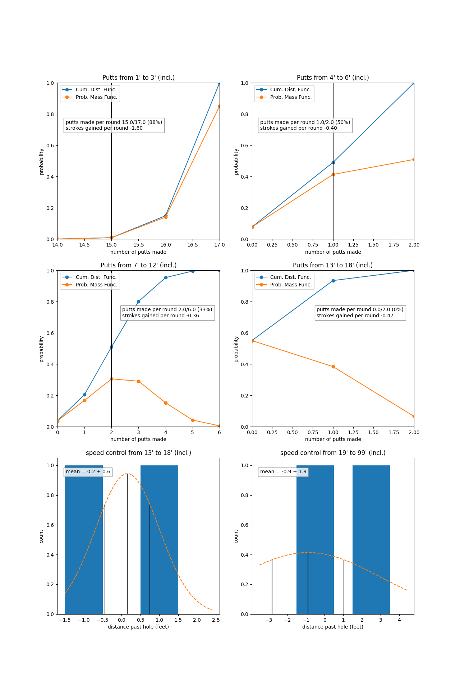

# Putting
Putting make rates compared to pro baseline for the latest round.

{: .note }
Looking at per round data for putting stats shows why it help to understand the probability distributions and not just the summary strokes gained stats. If you look at the 7'-12' and 13'-18' ranges, the strokes gained was -0.36 and -0.47 respectively. But when looking at the probability distributions, the number of putts made was the most likely outcome over each range. Even over the 4'-6' range, where I made 1 of 2 putts in that range, it was fairly close to equal probability that I would hole 1 or 2 putts in that range. And so I lost -0.40 strokes gained over this range, but probabilistically speaking it was a coin flip between losing -0.4 strokes gained or gaining 0.6 here. The only significant (probabilistically speaking) range here was missing 2 putts from 1'-3' feet, where I should not be missing putts from. When looking that the data this was, you can more clearly see what the main takeaway should be.

{: .note }
There are just not enough putts from this single round to learn anything about speed control, as you can see that there is a very large error on the mean, and so all we can say is there is not enough data to here to say there is anything wrong with the speed control for long putts.
