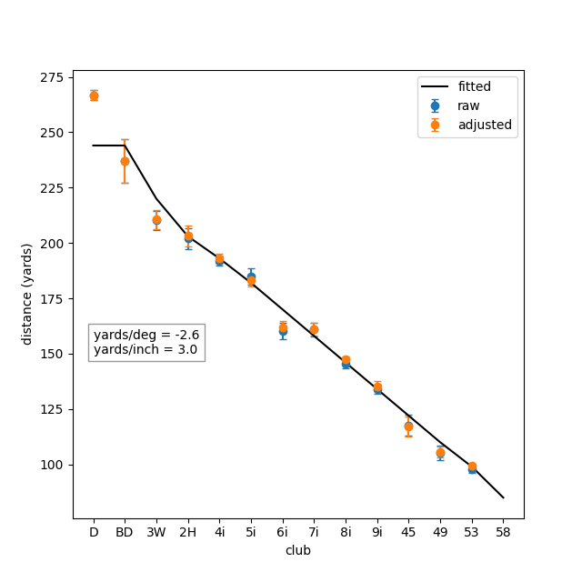

# Club Distances
* Raw and adjusted distances for each club with best fit line for length and loft of club.
* Raw distances are calculated from distance to target, miss direction and distance for next shot.
* Adjusted distances are adjusted for elevation, wind and any adjustments made for the shot for in between yardages.
* The error bars are the standard error (standard deviation of the distance hit / sqrt(n)),
  where n is the number of shots with that club.
* Clubs that have only one shot are assumed to have a standard deviation of 10 yards.
* The fit curve is a 2 parameter fit on the club loft and length, fitted to iron and wedge adjusted distances
  (excluding woods/hybrids/58º wedge).
* The fit is a weighted fit with the weights as 1/SEM^2.

