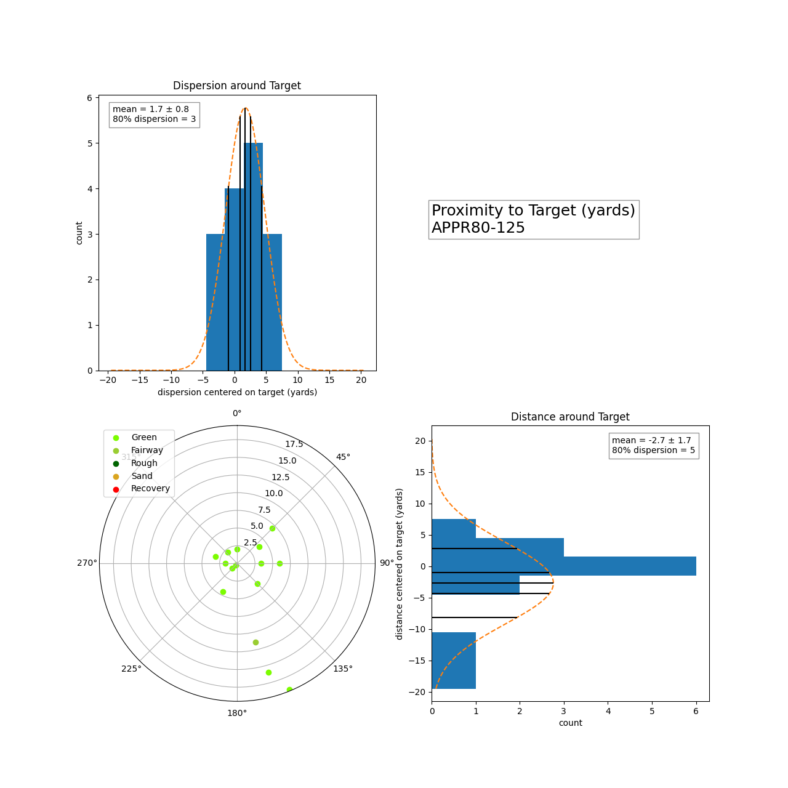
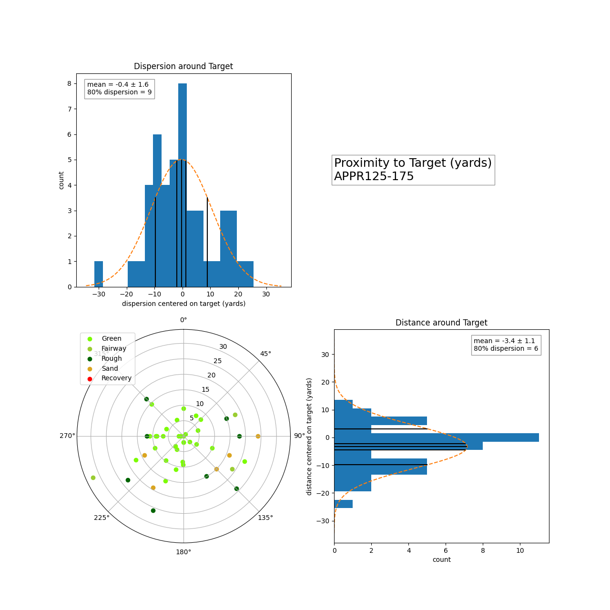
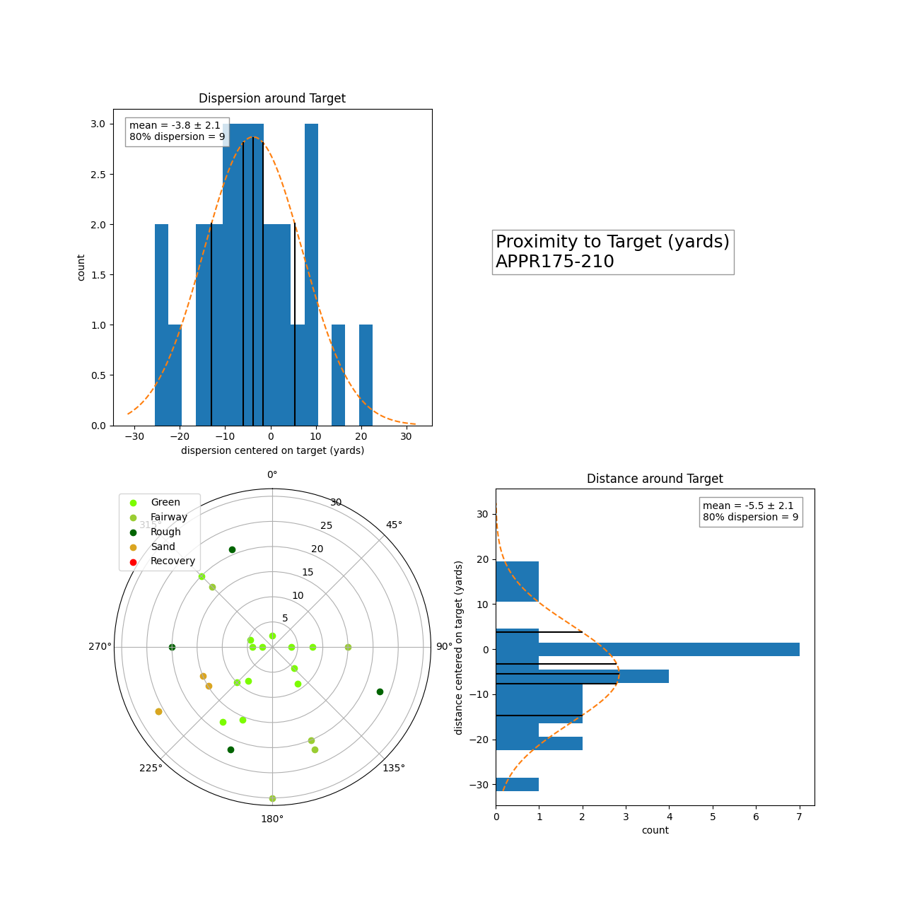
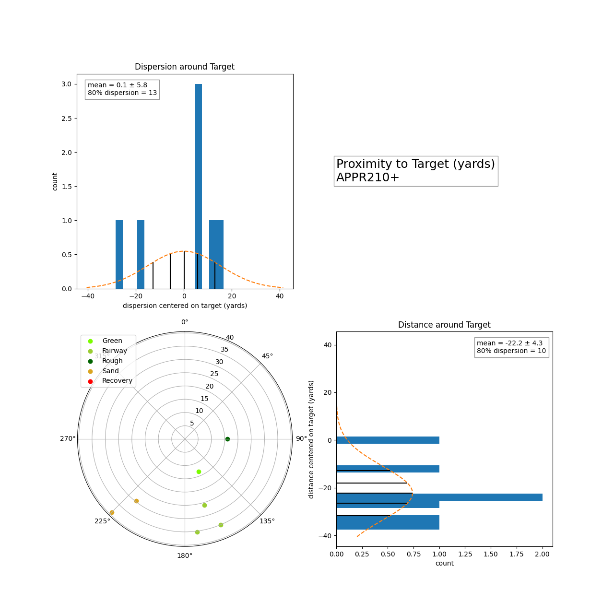

# Proximity to Target
Dispersion and distance control.
* Is your shot pattern centered on the target?
* Do you need to adjust your aim?
* Do you know how far you hit each club?

How these figures are calculated.
* Target, relative to hole location, tracked when collecting stats for round
* Miss directions tracked using a 16-point compass direction in stats notes for round
* Polar plots of shot patterns, with points labeled by where they ended up
* Polar plots projected onto cartesian grid for distance and dispersion measurements
* Normal distribution of distance and dispersion measured
* Means (and error of the mean) calculated to know if shot pattern is centered on target
* 80% confidence intervals calculated for distance/dispersion for use in appropriate target selection

## Approach 80-125 Yards

## Approach 125-175 Yards

## Approach 175-210 Yards

## Approach 210+ Yards

{: .note}
For dispersion, the mean (and the error of the mean) determines your aim. If zero lies outside the mean ± the error of the mean, then you need to adjust your aim as your shot pattern is not centered.

{: .note}
For distance, the mean (and the error of the mean) determines your distance control. If zero lies outside the mean ± the error of the mean, then you need to adjust how far you think you hit each club. The calculated distances for each club is given in [club distances](club_distances.md).

{: .note}
For dispersion, the 80% dispersion is to help with target selection. This determines how far away from trouble you need to aim for your approach shots. If the pin is tucked away, and if there is a water, a bunker, or a severe slope by the green then this tells you how far to aim away from this to be fairly certain you will avoid this trouble and being short sided. If the pin is close to the edge of the green, but the up and down is simple, then this dispersion does not need to be fully on the green, and can overlap some of the surrounds.

{: .note}
For distance, the 80% dispersion is to help with shots over traps to front pins, or shots to back bins. When a pin is tucked behind a bunker, you can use the club distance minus this dispersion for your minimum distance needed to clear the bunker for the approach shot. For back pins, you can use the club distance plus this dispersion for the back of the green. These numbers will be quoted in the yardage notes for easy reference during the round.
