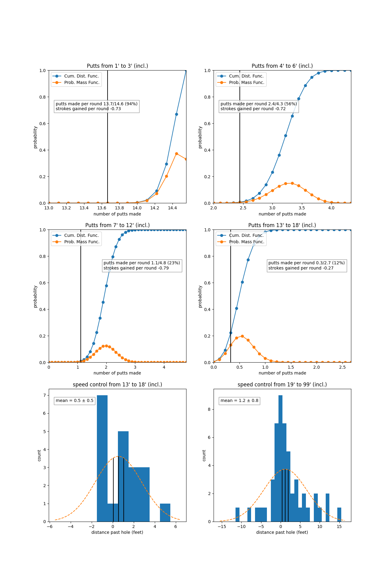

# Putting
Putting make rates compared to pro baseline.
* Vertical black line is number of made putts per round
* Orange line is the probability mass function of the pro baseline
  * Derived using baseline make rates for observed putts within window
  * Peak of orange line is most likely number of made putts an average pro would have made given your putts in the window
* Blue line is the cumulative distribution function of the pro baseline
* Speed control for missed putts for given window
  * Mean (with error of the mean) of distribution of putts calculated for speed control tracking

{: .note }
The putting distributions are to show how significant the results are given the amount of data you have.
They are useful for individual rounds as these are low statistic events and this distributions help determine how much you can rely on only a few putts per round to judge your performance.

{: .note }
The putting distribution model is a [Poisson binomial Distribution](https://en.wikipedia.org/wiki/Poisson_binomial_distribution). A Poisson binomial distribution is the discrete probability distribution of a sum of independent Bernoulli trials that are not necessarily identically distributed. In simpler terms is describes the probability distribution arising from a series of events that have different probabilities of success. Consider each putt is a probabilistic event with a probability of success determined by the length of the putt (which we obtain from the Pro putting make rates from Mark Brodie). The probability distribution of those putts is then just the product of these individual probabilities. This is a more accurate way to estimate the make rates for a given putting range, as it takes into account the length of each putt in the given window.

{: .note }
The distance distribution for the longer range putts over 19' seem to consist of 2 distributions, a narrow and a wide distribution. This makes sense that the speed distribution varies for easy and difficult long putts. When significant slopes are involved (which is more likely for long putts), the speed is much harder to estimate. Might consider modeling this are a sum of two distributions in a future version.
