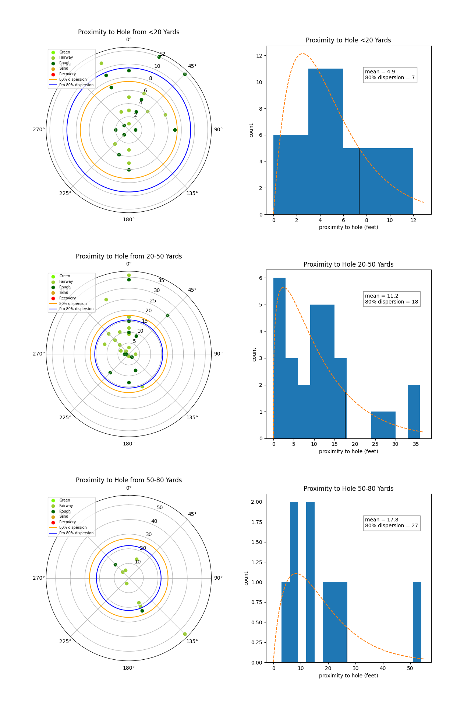
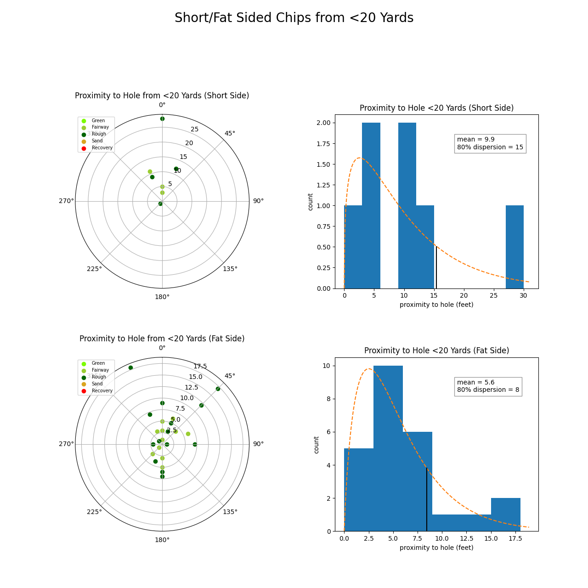
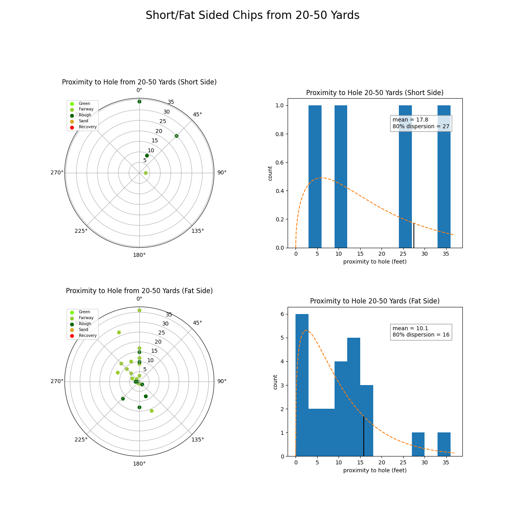
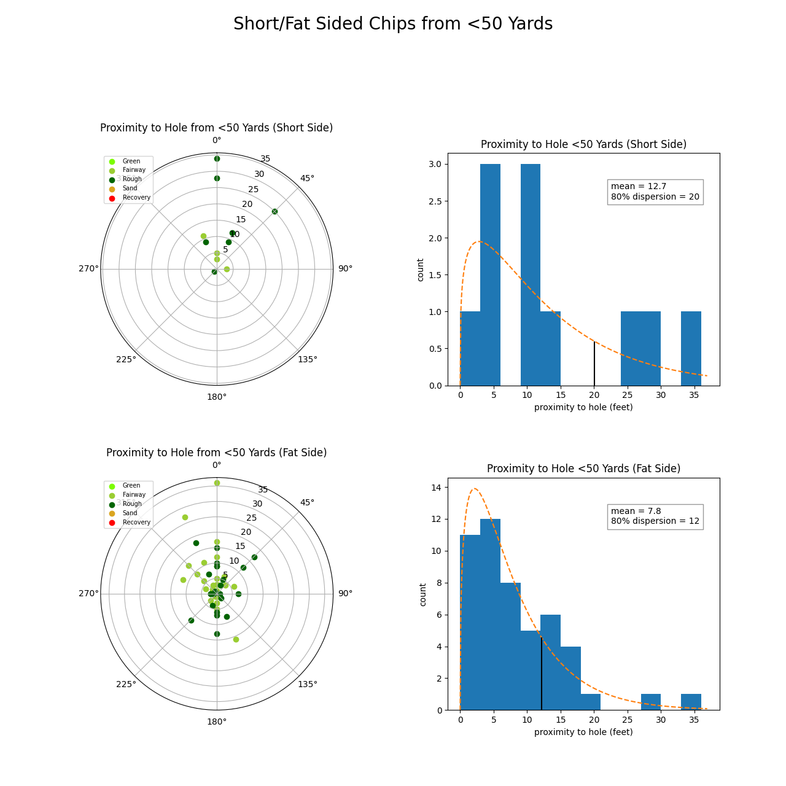

# Short Game Proximity to Hole
Proximity to hole for short game under 80 yards.
* Miss directions tracked using a 16-point compass direction in stats notes for round
* Polar plots of shot patterns, with points labeled by the lie they were played from
* Distribution plot of proximity to hole in feet, with fitted gamma distribution
* 80% dispersion of shots as obtained from distribution
* 80% pro distribution obtained from strokes gained data for shots actually played in this data
  * not based on average for given yardage range of shots
* Short game proximity broken down by short side/fat side shots
 
{: .definition }
> Short side defined as
> * miss in same quadrant as hole location
> * fraction of green relative to length of shot less than ½
> * hole location less than 8 yards from edge of green in direction of play
>   * estimated from hole location assuming ellipse-shaped green around hole location

## Proximity to Hole for Yardage Ranges

## Proximity to Hole from <20 Yards for Short/Fat Sided Misses

## Proximity to Hole from 20-50 Yards for Short/Fat Sided Misses

## Proximity to Hole from <50 Yards for Short/Fat Sided Misses

{: .note }
Note that the 80% dispersion for short sided shots is around twice that of fat sided shots. The proximity to the hole for short game is as much determined by how much green you have to work with between you and the hole, as it is by the distance to the hole and the lie. Tracking how often you short side yourself is critical in understanding your strokes gained for the short game.
