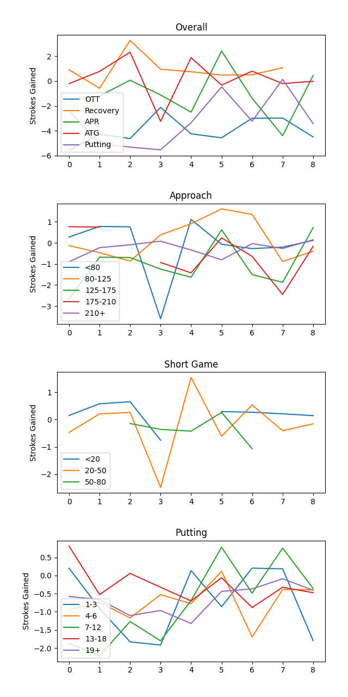
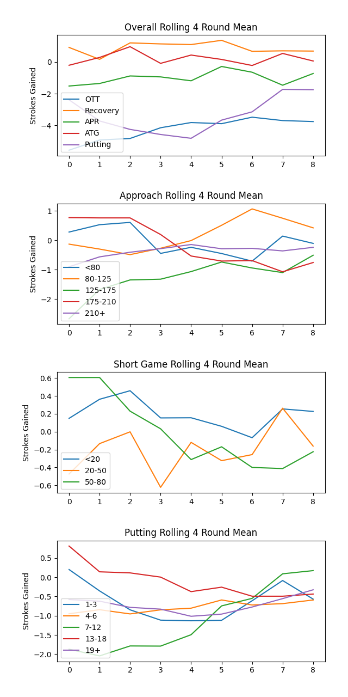

# Trend - Strokes Gained

## Per rounds strokes gained stats

{: .note }
The per rounds strokes gained stats are very noisy week-to-week. Too many read too much into a single round performance for strokes gained stats. Are you really observing a round to round actual change, or just observing the variability that is inherent in golf?

## Rolling 4 round mean of strokes gained stats

{: .note }
Taking a 4 round rolling mean of the strokes gained stats smooths out the inherent random changes from round to round, and then we can observe the real trend in the data.
